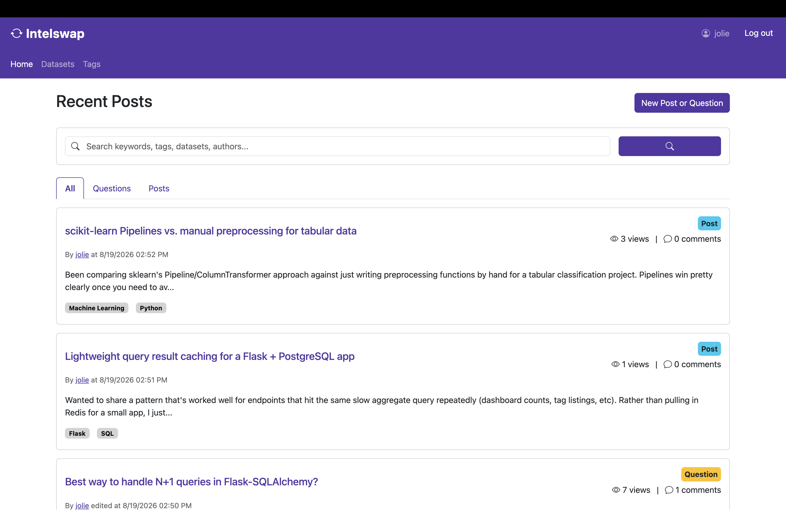
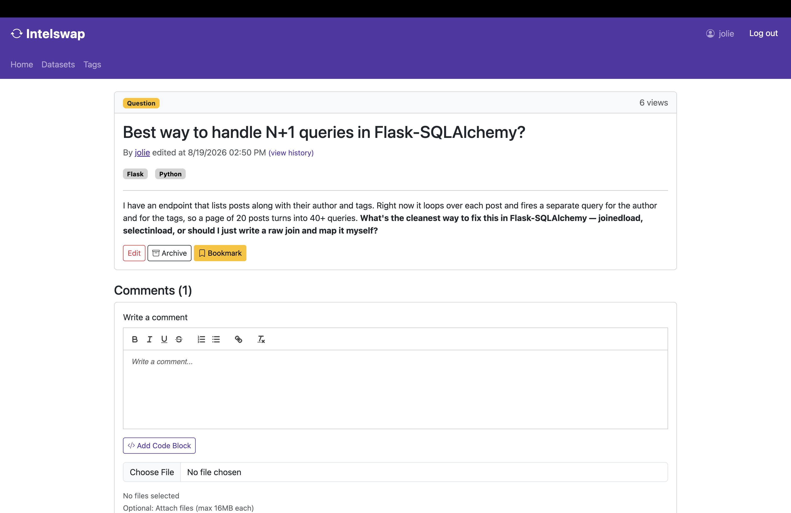
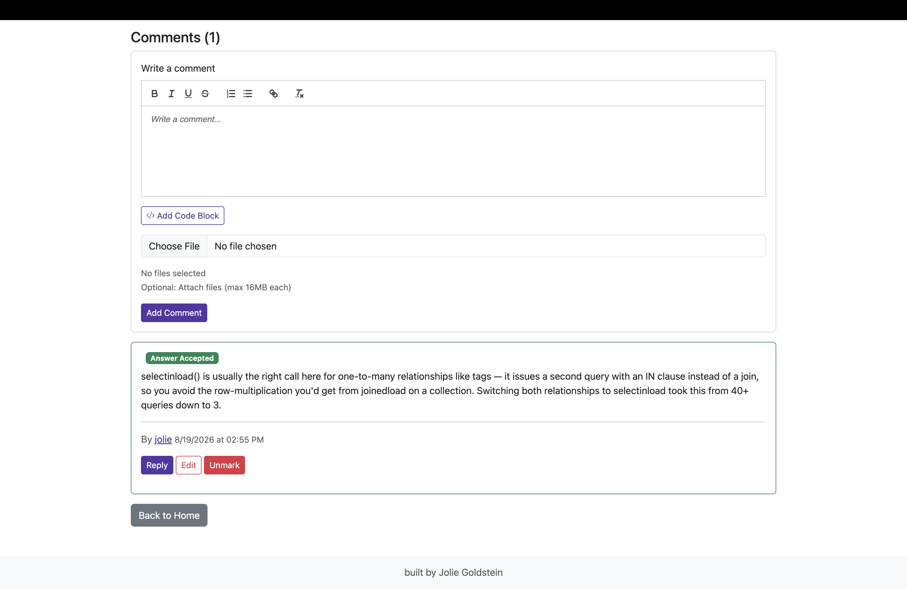
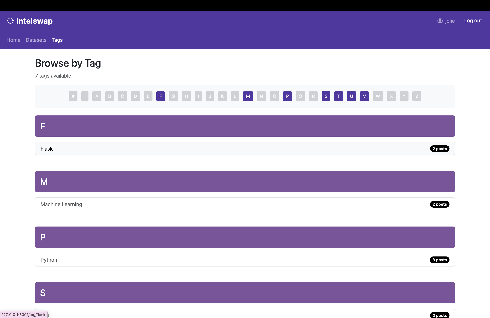
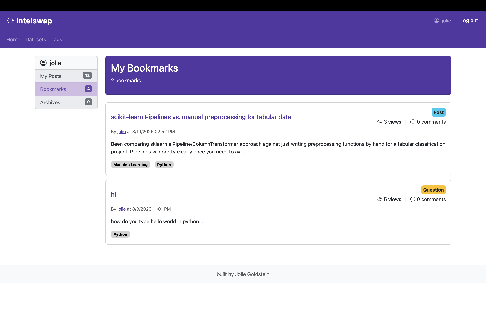

# Intelswap
A Stack Overflow-style Q&A and knowledge-sharing built for a specific organization's internal (technical) knowledge - in this case, originally built for the Federal Reserve Board (since altered and renamed for this standalone version). Users post questions or posts, get answers via nested comment threads, mark accepted answers, tag and link posts to reference databases, bookmark content, and track edit history on every post.

## Screenshots
> Seeded with synthetic demo content — the original Knowledge Exchange platform handled internal Federal Reserve research data, which isn't shown here.

### Home Feed

Recent posts and questions, filterable by type, with tag labels and view/comment counts at a glance.

### Question Detail

A technical question with tagging (Flask, Python) and inline actions — edit, archive, and bookmark.

### Accepted Answer

Comment threading with an accept-answer mechanic, so the best solution to a question is marked and surfaced.

### Browse by Tag

Content organized and discoverable by topic tag, with live post counts per tag.

### Bookmarks

Users can save posts and questions to revisit later from a personal bookmarks view.

**Stack:** Flask, PostgreSQL, Jinja2, psycopg2, Flask-login

## Why this exists
 
I originally designed and built this application independently, with engineering mentorship, as an Application Design & Development intern at the Federal Reserve Board (Division of Research & Statistics), where it served as an internal knowledge-sharing tool for the research staff. This repo is a standalone rebuild I did afterward, adapted to run anywhere rather than on Fed-internal infrastructure. The application logic, database design, and UI are the code I wrote at the Fed; the adaptation work (below) is what I did to make it portable and public.
 
## What changed for the standalone version
 
- **Authentication:** the original used SSO via reverse-proxy header injection, with no login screen at all. This version has a real session-based login (`/login`, `/logout`) via Flask-Login.
- **User avatars:** the original pulled photos from an internal Fed employee-photo directory. That's removed here, since it's not relevant outside that context.
- **File storage:** the original used a hardcoded path on a Fed server. This version reads the upload path from an environment variable, defaulting to `./static/uploads`.
- **Secrets:** the original had its secret key hardcoded in source. This version loads it from a `.env` file, excluded from git.
- **Branding:** renamed and rebranded from the internal tool name to **Intelswap**.

Additionally, I rebuilt the database layer (`db_helper.py`) from scratch to match the query patterns the rest of the app already relies on.

## Features
 
- **Q&A and posts** with rich-text (Quill) and code-snippet editing, syntax highlighting for Python/JS/SQL/R/shell via CodeMirror
- **Nested comment threads** with accepted-answer marking on questions
- **Full version history** on posts — every edit is preserved and viewable, not overwritten
- **Tagging** (up to 10 tags per post) and **dataset linking**, each with dedicated browse pages
- **Bookmarking** and a personal archive view, scoped per user
- **Keyword search** across post titles and bodies, with exact-phrase matching support
- Paginated feeds throughout, filterable by post type and answered/unanswered status

## Setup
 
Requires Python 3.10+ and a local PostgreSQL install.
 
```bash
git clone https://github.com/jog228/intelswap.git
cd intelswap
 
python3 -m venv venv
source venv/bin/activate
 
pip install -r requirements.txt
 
createdb intelswap
psql -d intelswap -f schema.sql
 
cp .env.example .env   # then fill in your local DB_USER, SECRET_KEY, etc.
 
python app.py
```
 
Visit `http://localhost:5001` (or whichever port you set) and log in from `/login` — enter any username to create a demo account, no password required. This is a deliberate simplification for the portfolio build; the original used Fed SSO instead.
 
## Project structure
 
```
intelswap/
├── app.py                 # Routes and application logic
├── db_helper.py            # Database connection + query helpers
├── schema.sql              # PostgreSQL schema + demo seed data
├── requirements.txt
├── templates/
│   ├── base.html
│   ├── login.html
│   ├── home.html
│   ├── posts/               # new/view/edit post, edit history
│   └── profile/              # profile, bookmarks, archive
└── static/
    └── uploads/              # user-uploaded attachments (gitignored)
```